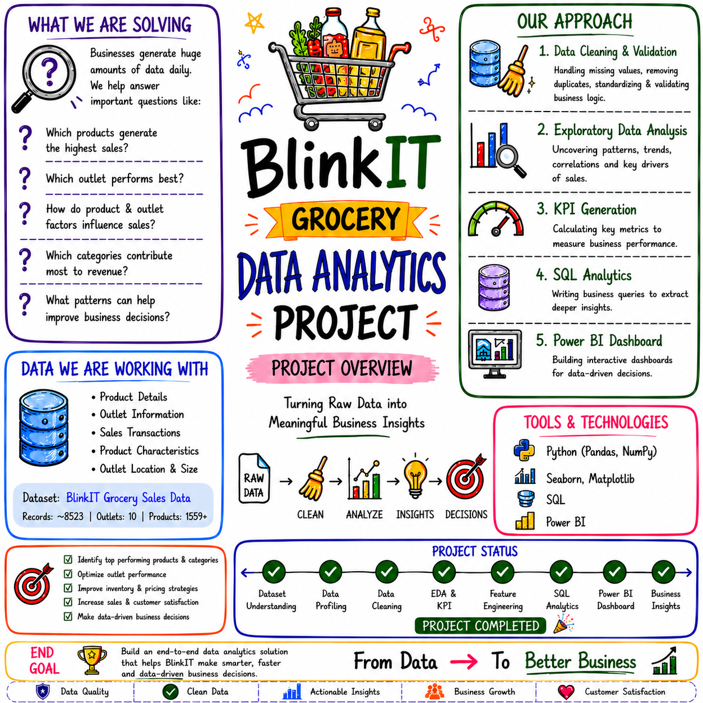
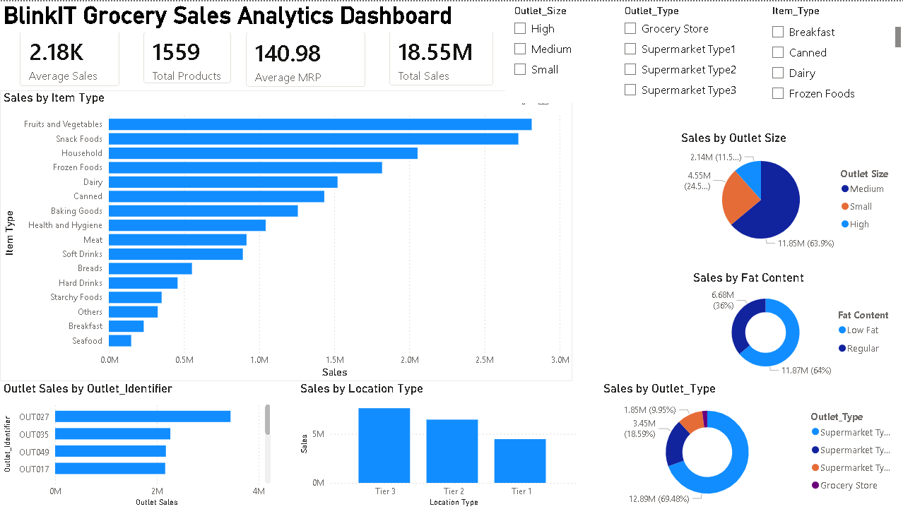

# 🛒 BlinkIT Grocery Data Analytics Project


<p align="center">
  
</p>

Transforming raw grocery sales data into meaningful business insights using Python, SQL, and Power BI.

---

## Project Overview

This project performs an end-to-end analytics workflow on BlinkIT grocery sales data.

The project simulates a real-world business scenario where raw and inconsistent data is cleaned, analyzed, transformed, and converted into actionable insights for business decision-making.

### Goal

- Think and work like a Data Analyst
- Build an end-to-end analytics pipeline
- Create business insights from raw data
- Generate business recommendations using SQL and dashboards

---

## Business Problem

Businesses generate huge amounts of raw data every day.

Without proper analysis, it becomes difficult to answer questions such as:

- Which products generate the highest sales?
- Which outlet performs best?
- How do product characteristics influence sales?
- Which categories contribute most to revenue?
- Which business factors drive revenue?
- What patterns can improve business decisions?

---

## Project Progress

Dataset Understanding      ✅  
Data Profiling             ✅  
Data Cleaning              ✅  
Exploratory Data Analysis  ✅  
Feature Engineering        ✅  
KPI Creation               ✅  
SQL Analytics              ✅  
Power BI Dashboard         ✅  
Business Insights          ✅  
Portfolio Optimization     ✅  

---

## Dashboard Preview

<p align="center">
  
</p>

---

## Feature Engineering Completed

Created Features:

- Outlet_Age
- Price_Category
- Product_Category
- Visibility_Category
- Fat_Content_Code

---

## KPI Summary

| KPI | Value |
|------|--------|
| Total Sales | ₹18.55M |
| Average Sales | ₹2,182 |
| Average MRP | ₹140.98 |
| Total Products | 1559 |
| Total Outlets | 10 |

---

## SQL Analytics Summary

| Analysis Area | Key Finding |
|---------------|-------------|
| Product Revenue | Fruits & Vegetables generated highest revenue |
| Outlet Type | Supermarket Type1 generated highest total sales |
| Average Outlet Performance | Supermarket Type3 generated highest average sales |
| Location Analysis | Tier 3 generated highest total revenue |
| Outlet Ranking | OUT027 consistently ranked highest |
| Bottom Performers | OUT010 and OUT019 consistently ranked lowest |
| Product Classification | Products categorized using CASE WHEN |
| Business Recommendation | Fruits & Vegetables, Snack Foods, and Household identified as priority categories |

---

## Key Business Findings

### Revenue Drivers

- Fruits & Vegetables generated highest revenue
- Snack Foods and Household products showed strong performance
- Tier 3 locations generated strongest total revenue
- Supermarket Type1 contributed nearly 70% of total sales
- OUT027 repeatedly ranked highest across metrics

### Weak Contributors

- Grocery Stores showed weakest performance
- OUT010 and OUT019 consistently ranked low
- Fat Content showed weak influence on sales
- Visibility showed weak relationship with sales

---

## Business Insights & Recommendations

### Key Insights

1. Fruits & Vegetables generated the highest revenue, indicating strong customer demand and consistent sales volume.

2. Supermarket Type1 contributed nearly 70% of total sales, making it the primary revenue driver.

3. Tier 3 locations generated the strongest overall revenue, suggesting higher market potential in these areas.

4. OUT027 consistently ranked as the top-performing outlet across multiple analyses.

5. Medium-sized outlets generated the highest sales, indicating an effective balance between capacity and operations.

6. Grocery Stores showed the weakest performance, suggesting opportunities for strategy improvement.

7. Regular and Low Fat products showed only small sales differences, indicating fat content has limited influence on purchasing behavior.

8. Priority categories identified:
   - Fruits & Vegetables
   - Snack Foods
   - Household

### Business Recommendations

- Increase inventory for high-performing categories
- Expand strategies used by OUT027 to similar outlets
- Improve performance strategies for Grocery Stores
- Focus marketing efforts on Tier 3 markets
- Maintain stock availability for top-selling products

---

## Tech Stack

### Programming & Analysis

- Python
- Pandas
- NumPy

### Visualization

- Matplotlib
- Seaborn
- Power BI

### Database

- SQL (SQLite)

---

## Project Structure

```text
blinkit_analysis
│
├── Dataset
│   ├── blinkit_dirty_dataset.csv
│   └── blinkit_cleaned_dataset.csv
│
├── Images
│   ├── overview.png
│   └── dashboard.png
│
├── Python
│   ├── data_cleaning.ipynb
│   ├── eda_analysis.ipynb
│   └── feature_engineering.ipynb
│
├── SQL
│   └── blinkit_queries.sql
│
├── BlinkIT_Grocery_Sales_Analytics_Dashboard.pbix
│
├── create_db.py
├── blinkit.db
├── README.md
└── .gitignore

```
---

## Future Enhancements

- Advanced business insights
- Predictive analytics
- Time series forecasting
- Sales prediction models

---

## Author

**Saurin Parmar**  
Aspiring Data Analyst | Python • SQL • Power BI